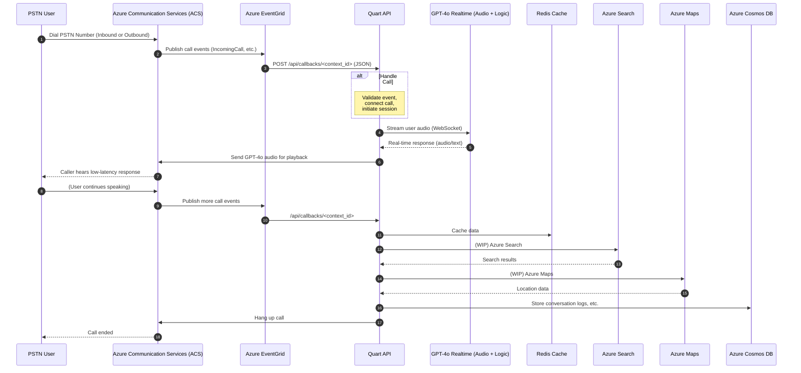
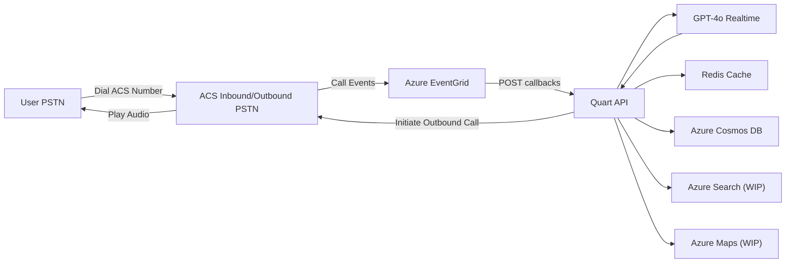
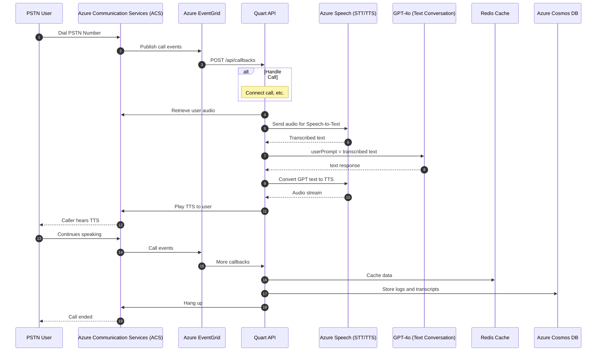
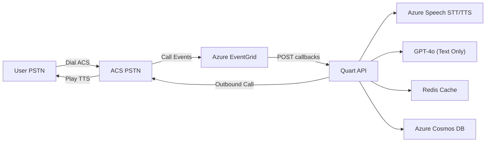

# Call Automation with Gen AI and Azure Communication Service (ACS)

> [!WARNING]
> This Solutions Accelerator is in early stages and is subjected to changes.

## Table of Contents
- [Features](#features)
- [Solution Approaches](#solution-approaches)
  - [Approach 1: GPT-4o Realtime](#approach-1-gpt-4o-realtime)
  - [Approach 2: Azure AI Speech Services + GPT-4o](#approach-2-azure-ai-speech-services--gpt-4o)
- [Prerequisites](#prerequisites)
- [Setup and Installation](#setup-and-installation)
- [Running it locally](#running-it-locally)
- [Running it on Azure](#running-it-on-azure)
- [Test the app with an outbound phone call](#test-the-app-with-an-outbound-phone-call)
---
## Features
- **PSTN Calling**: Users can call a phone number provisioned by **Azure Communication Services (ACS)**, and the voice assistant provides real-time interactions using either **GPT-4o Realtime** or **Azure AI Speech Services** + GPT-4o (STT/TTS approach).
- **GPT-4o**: Enables dynamic, context-aware conversations for potential candidates based on job descriptions. Supports multimodal data (text/audio), with minimal latency if using GPT-4o Realtime.
- **Event-Driven Architecture**: **Azure EventGrid** routes call-related events (e.g., `IncomingCall`, `CallConnected`) from ACS to a **Quart** application, ensuring a reactive, decoupled design.
- **Redis Caching**: Speeds up lookups by storing job details, competency questions, and candidate data, reducing repeated API calls.
- **Azure Services**:
  - **Azure Maps** (WIP): Provides geographic location data for proximity checks.  
  - **Azure Search** (WIP): Queries job details and relevant data.  
  - **Azure Cognitive Services**: Optionally provides **Speech-to-Text** (STT) and **Text-to-Speech** (TTS) if you do not use GPT-4o Realtime for audio. 
- **Session History**: Stores conversation logs, transcripts (if generated), and call recordings in **Azure Cosmos DB** for long-term analytics or auditing.
---

## Architecture Overview

Regardless of which approach you use, the following Azure services are key:

1. **Azure Communication Services (ACS)**: Manages **inbound** and **outbound** PSTN calls.  
2. **Azure EventGrid**: For **event-driven** call management (routes `IncomingCall`, `CallConnected`, etc. to the Quart API).  
3. **Redis Cache**: Stores hot data (job details, candidate context).  
4. **Azure Cosmos DB**: Persists session data (call recordings, transcripts, conversation logs).  
5. **Azure Maps** (WIP) and **Azure Search** (WIP): Optional for location-based queries and advanced job searches.

**However**, for the **audio** and **conversation** pipeline, you have **two approaches**:

---

## Prerequisites

- **Azure Subscription** with access to Azure OpenAI models.  
- **Python 3.10+** installed on your local environment.  
- **Azure Dev Tunnel** (or alternative) for handling ACS callback URLs if testing locally.  
- **Terraform** to deploy the IaC in the `automation` folder.
---

## Solution Approaches

### Approach 1: GPT-4o Realtime

In this scenario, **GPT-4o Realtime** handles **both** the **audio input** (received from the user via ACS) and the **audio output** (sent back to ACS). No separate STT or TTS services are required.

#### Sequence Diagram (GPT-4o Realtime)



**Key Points**:  
1. **No STT/TTS** from Azure AI Speech Services — GPT-4o Realtime directly processes audio streams, returning audio responses.  
2. **Low-latency** conversation, typically hundreds of milliseconds.  
3. All other aspects (EventGrid, Redis, Cosmos DB, etc.) remain the same.

#### Flowchart (Inbound & Outbound with GPT-4o Realtime)



1. **Quart** can receive inbound calls via ACS or **initiate outbound calls**.  
2. **GPT-4o Realtime** handles audio input and output.  
3. **Redis**, **Cosmos DB**, **Azure Search**, and **Azure Maps** remain optional expansions of the overall architecture.

---

### Approach 2: Azure AI Speech Services + GPT-4o

In this scenario, you **do** use **Azure AI Speech Services** for **Speech-to-Text (STT)** and **Text-to-Speech (TTS)**. **GPT-4o** is used for **text-based** conversation logic only. The **audio** pipeline flows through **Azure Speech** for **recognition** and **synthesis**:

1. **User** speaks to the PSTN phone.  
2. **ACS** captures audio and triggers events via EventGrid to **Quart**.  
3. **Quart** sends the captured audio to **Azure Speech** for **STT**.  
4. **Quart** then calls **GPT-4o** with the **transcribed text**. GPT-4o returns a **text response**.  
5. **Quart** uses **Azure Speech** to synthesize **TTS** from GPT-4o’s text.  
6. **ACS** plays the TTS audio to the user.

#### Sequence Diagram (Azure Speech Services + GPT-4o)



**Key Differences**:  
- The conversation logic is **still GPT-4o** (text-based).  
- **Azure Speech** services handle **speech recognition (STT)** and **speech generation (TTS)**.  
- Latency can be slightly higher than GPT-4o Realtime for audio, but you gain more explicit STT/TTS customization options (e.g., voice fonts, domain-specific speech models).

#### Flowchart (Inbound & Outbound with Azure Speech + GPT-4o)



1. **Inbound/Outbound** calls managed by ACS.  
2. **Quart** uses **Azure Speech** to handle the voice aspects (speech recognition and speech synthesis).  
3. **GPT-4o** is only given **text** from STT and returns **text** for TTS.  
4. **Redis** and **Cosmos DB** remain central for caching and logging.

---

## Setup and Installation
### 0. Fork the repository
Fork the repo to your GitHub account.
### 1. Clone the Repository

```bash
git clone https://github.com/your-repository-name/voice-assistant
cd voice-assistant
```

### 2. Install Python Dependencies
Create a virtual environment and install the required Python libraries listed in `./api/requirements.txt`.

#### Bash
```bash
python3 -m venv .venv
source .venv/bin/activate
pip install -r api/requirements.txt
```

#### PowerShell
```powershell
python3 -m venv .venv
.venv/Scripts/Activate.ps1
pip install -r api/requirements.txt
```
### 3. Deploy the Terraform IaC
> [!Note]
> You need to have activated the venv and installed the requirements as the IaC automation contains python scripts that require specific libraries.
Navigate to for the details for the [Terraform automation deployment Doc](automation/README.md).

Make sure to follow the manual step of navigating inside the ACS resource and connecting it to the Cognitive Service (aka AI multiservices account) via Managed Identity. This process happens in the background when you do it from ACS. If this step is not done, the phone call will happen but it will hang up instantly.


## Running it locally

### 1. Add the Environment Variable values to a .env file
Based on `.env.sample`, create and construct your `.env` file to allow your local app to access your Azure resource.

### 2. Enable and run a Microsoft DevTunnel
> [!NOTE]
>- Azure Dev Tunnels CLI. For details, see  >[Enable dev tunnel](https://docs.tunnels.api.>visualstudio.com/cli)
>- Create an Azure Cognitive Services resource. >For details, see [Create an Azure Cognitive >Services Resource](https://learn.microsoft.com/>en-us/azure/cognitive-services/>cognitive-services-apis-create-account)
>- Create and host a Azure Dev Tunnel. > Instructions [here](https://learn.microsoft.com/>en-us/azure/developer/dev-tunnels/get-started)

[Azure DevTunnels](https://learn.microsoft.com/en-us/azure/developer/dev-tunnels/overview) is an Azure service that enables you to share local web services hosted on the internet. Use the commands below to connect your local development environment to the public internet. This creates a tunnel with a persistent endpoint URL and which allows anonymous access. We will then use this endpoint to notify your application of calling events from the ACS Call Automation service.

#### Running it for the first time:

```bash
devtunnel login
devtunnel create --allow-anonymous
devtunnel port create -p 8000
devtunnel host
```
Add the devtunnel link structured as `https://<name>.devtunnels.ms:8080` to the `.env` file as callback URI host.

#### Leveragin a previously created DevTunnel:
```bash
devtunnel login
devtunnel list
# copy the name of the devtunnel you want to target
devtunnel host <your devtunnel name> 
```
Then run the python app by running `python3 api/main.py` on your terminal and check that it runs with no issues before proceeding.

Once the tunnel is running, navigate to your Azure Event Grid System Topic resource and click on *+ Event Subscription*. Create a local subscription to your local app for the event `IncomingCall` as a webhook, with the URL `https://<your devtunnel name>.devtunnels.ms:8000/api/incomingCall`. Note that both the devtunnel and the python app should be running for this step to work.

## Running it on Azure
Once the IaC has been deployed, the web API should be ready to use. Feel free to configure the system message within constants.

## Test the app with an outbound phone call

Send an HTTP request to the web API following the sample on `outbound.http`. To make the request on VSCode, you can use the *Rest Client* extension and then, on the file, click on *Send Request* on top of the `POST` method.

Make sure you send a payload that meets the requirements by leveraging the existing sample on the same file. The validation can be edited on `./api/src/core/app.py` within the `initiate_outbound_call()` function.
