# Azure AI Voice Live Integration with Azure Communication Services

A production-ready voice assistant solution using Azure AI Voice Live API for real-time, low-latency voice interactions through Azure Communication Services.

## 🎯 **What This Solution Provides**

- **Real-time Voice Agent**: Direct audio-to-audio processing with Azure AI Voice Live API
- **Low Latency**: < 500ms response times with advanced audio processing
- **Production Ready**: Complete infrastructure deployment with Terraform
- **Advanced Audio Features**: Noise suppression, echo cancellation, interruption handling
- **Scalable Architecture**: Event-driven design with Azure services integration

## 📋 **Table of Contents**
- [Quick Start](#quick-start)
- [Prerequisites](#prerequisites)
- [Architecture Overview](#architecture-overview)
- [Step-by-Step Setup](#step-by-step-setup)
- [Configuration](#configuration)
- [Deployment](#deployment)
- [Testing](#testing)
- [Troubleshooting](#troubleshooting)
- [Production Considerations](#production-considerations)

## 🚀 **Quick Start**

**Already have Azure access?** Deploy in 15 minutes:

```bash
# 1. Clone and setup
git clone https://github.com/abs0914/acs-azopenai-voice-integration.git
cd acs-azopenai-voice-integration

# 2. Configure your API key
cd automation
# Edit terraform.tfvars with your Azure Voice Live API key

# 3. Deploy everything
./deploy_complete_solution.sh  # Linux/Mac
# OR
.\deploy_complete_solution.ps1  # Windows

# 4. Test your phone number
# Call the number provided in the deployment output
```

## 📋 **Prerequisites**

### Required Azure Services
- **Azure Subscription** with contributor access
- **Azure AI Voice Live API** access and API key
- **Azure Communication Services** with phone number capability
- **Azure OpenAI** (for fallback scenarios)

### Development Tools
- **Python 3.10+**
- **Terraform** (latest version)
- **Azure CLI** (logged in)
- **Git**

### Optional (for local development)
- **Azure Dev Tunnels** or **ngrok** for webhook testing

## 🏗️ **Architecture Overview**

This solution uses **Azure AI Voice Live API** for direct audio-to-audio processing, eliminating the traditional STT/TTS pipeline for significantly reduced latency.

### Core Components

```mermaid
flowchart TB
    U[📞 Phone User] --> ACS[Azure Communication Services]
    ACS --> EG[Azure EventGrid]
    EG --> API[Quart API Application]
    API --> VL[Azure AI Voice Live API]
    API --> Cache[Redis Cache]
    API --> DB[Cosmos DB]
    
    VL --> |Real-time Audio| API
    API --> |Audio Response| ACS
    ACS --> |Voice Output| U
```



### Key Services

1. **Azure Communication Services (ACS)**: Manages PSTN phone calls and media streaming
2. **Azure AI Voice Live API**: Provides real-time audio-to-audio AI processing
3. **Azure EventGrid**: Routes call events to your application
4. **Quart API**: Python web application handling call automation
5. **Redis Cache**: Session management and performance optimization
6. **Cosmos DB**: Conversation logging and analytics
7. **Azure OpenAI**: Fallback for traditional STT/TTS approach

### Voice Live Integration Benefits

- **Ultra-low Latency**: < 500ms response times
- **Advanced Audio Processing**: Built-in noise suppression and echo cancellation
- **Natural Interruptions**: Semantic voice activity detection
- **No STT/TTS Pipeline**: Direct audio-to-audio processing
- **Production Scale**: Managed infrastructure with global availability

## 📝 **Step-by-Step Setup**

### Step 1: Clone and Prepare Repository

```bash
# Clone the repository
git clone https://github.com/abs0914/acs-azopenai-voice-integration.git
cd acs-azopenai-voice-integration

# Create Python virtual environment
python3 -m venv .venv
source .venv/bin/activate  # Linux/Mac
# OR
.venv\Scripts\Activate.ps1  # Windows

# Install dependencies
pip install -r api/requirements.txt
```

### Step 2: Configure Azure Voice Live API

1. **Obtain Azure AI Voice Live API Access**
   - Request access through Azure portal
   - Create Azure AI Voice Live resource in `eastus2` region
   - Note your API key and endpoint

2. **Configure Terraform Variables**
   ```bash
   cd automation
   cp terraform.tfvars.example terraform.tfvars
   ```

   Edit `terraform.tfvars`:
   ```hcl
   # Required: Your Azure Voice Live API key
   azure_voice_live_api_key = "YOUR_ACTUAL_API_KEY_HERE"
   
   # Optional: Customize deployment
   prefix = "tf-ai"
   name = "aivoice"
   environment = "dev"
   location = "East US 2"
   ```

### Step 3: Deploy Azure Infrastructure

```bash
# Ensure you're logged into Azure CLI
az login
az account show

# Deploy infrastructure
cd automation
terraform init
terraform plan
terraform apply
```

**What gets deployed:**
- Azure Communication Services with phone number
- Azure AI Voice Live integration
- Azure App Service for hosting
- Redis Cache for session management
- Cosmos DB for conversation logging
- EventGrid for call event routing
- All necessary networking and security configurations

### Step 4: Deploy Application Code

The deployment script handles this automatically, but you can also do it manually:

```bash
# Commit and push changes to trigger GitHub Actions
git add .
git commit -m "Deploy Azure AI Voice Live integration"
git push origin main

# Monitor deployment
# Go to: https://github.com/your-username/acs-azopenai-voice-integration/actions
```

## ⚙️ **Configuration**

### Environment Variables (Automatically Set by Terraform)

```bash
# Azure Communication Services
ACS_CONNECTION_STRING="endpoint=https://..."
AGENT_PHONE_NUMBER="+1844..."

# Azure AI Voice Live API
AZURE_VOICE_LIVE_ENDPOINT="https://vida-voice-live.cognitiveservices.azure.com/"
AZURE_VOICE_LIVE_API_KEY="your-api-key"
AZURE_VOICE_LIVE_DEPLOYMENT="gpt-4o-realtime-preview"
AZURE_VOICE_LIVE_REGION="eastus2"
VIDA_VOICE_BOT_ASSISTANT_ID="asst_dEODj1Hu6Z68Ebggl13DAHPv"

# Application Settings
CALLBACK_URI_HOST="https://your-app.azurewebsites.net"
REDIS_URL="your-redis.redis.cache.windows.net"
COSMOS_DB_URL="https://your-cosmos.documents.azure.com:443/"

# Fallback (Azure OpenAI)
AZURE_OPENAI_SERVICE_ENDPOINT="https://your-openai.openai.azure.com/"
AZURE_OPENAI_SERVICE_KEY="your-openai-key"
```

### Voice Live Session Configuration

The application automatically configures optimal settings:

```python
session_config = {
    "turn_detection": {
        "type": "azure_semantic_vad",
        "threshold": 0.3,
        "prefix_padding_ms": 200,
        "silence_duration_ms": 200
    },
    "input_audio_noise_reduction": {"type": "azure_deep_noise_suppression"},
    "input_audio_echo_cancellation": {"type": "server_echo_cancellation"},
    "voice": {
        "name": "en-US-Aria:DragonHDLatestNeural",
        "type": "azure-standard",
        "temperature": 0.8
    }
}
```

## 🚀 **Deployment**

### Automated Deployment (Recommended)

Use the provided deployment scripts for a complete setup:

**Windows (PowerShell):**
```powershell
.\deploy_complete_solution.ps1
```

**Linux/Mac (Bash):**
```bash
./deploy_complete_solution.sh
```

**What the script does:**
1. ✅ Validates prerequisites (Terraform, Azure CLI, Git)
2. ✅ Deploys Terraform infrastructure
3. ✅ Commits and pushes code changes
4. ✅ Triggers GitHub Actions deployment
5. ✅ Validates the deployment

### Manual Deployment

If you prefer manual control:

```bash
# 1. Deploy infrastructure
cd automation
terraform init
terraform plan
terraform apply

# 2. Deploy application
git add .
git commit -m "Deploy Azure AI Voice Live integration"
git push origin main

# 3. Validate deployment
python validate_deployment.py
```

### GitHub Actions Configuration

Ensure your GitHub repository has the correct publish profile secret:

1. Go to Azure Portal → App Services → your-app-name
2. Click "Get publish profile" and download
3. Go to GitHub → Settings → Secrets and variables → Actions
4. Add secret: `AZUREAPPSERVICE_PUBLISHPROFILE_[UNIQUE_ID]`
5. Paste the publish profile content

## 🧪 **Testing**

### Health Check Endpoints

After deployment, test these endpoints:

```bash
# Basic health check
curl https://your-app.azurewebsites.net/api/health

# Voice Live integration test
curl https://your-app.azurewebsites.net/api/testVoiceLive

# Root endpoint
curl https://your-app.azurewebsites.net/
```

### Phone Call Testing

1. **Get your phone number** from the Terraform output
2. **Call the number** - you should hear the Voice Live agent
3. **Test conversation** - speak naturally and verify responses
4. **Check logs** in Azure Portal → App Service → Log stream

### Local Development Testing

For local development with webhooks:

```bash
# 1. Start your application
cd api
python main.py

# 2. Create dev tunnel (new terminal)
devtunnel create --allow-anonymous
devtunnel port create -p 8000
devtunnel host

# 3. Configure EventGrid subscription
az eventgrid event-subscription create \
  --name "local-testing" \
  --source-resource-id "/subscriptions/.../communicationServices/your-acs" \
  --endpoint "https://your-tunnel.devtunnels.ms/api/incomingCall" \
  --included-event-types "Microsoft.Communication.IncomingCall"
```

## 🔧 **Troubleshooting**

### Common Issues

#### 1. "Unable to complete call" Error
**Cause**: EventGrid webhook not configured
**Solution**:
```bash
# Verify webhook endpoint is accessible
curl https://your-app.azurewebsites.net/api/incomingCall

# Check EventGrid subscription exists
az eventgrid event-subscription list --source-resource-id "your-acs-resource-id"
```

#### 2. Voice Live Connection Fails
**Cause**: Invalid API key or endpoint
**Solution**:
```bash
# Test Voice Live endpoint
curl https://your-app.azurewebsites.net/api/testVoiceLive

# Check environment variables in Azure Portal
# App Service → Configuration → Application settings
```

#### 3. GitHub Actions Build Fails
**Cause**: Missing publish profile or dependencies
**Solution**:
- Verify publish profile secret is configured
- Check `api/requirements.txt` exists
- Review GitHub Actions logs for specific errors

#### 4. Application Won't Start
**Cause**: Missing environment variables or startup issues
**Solution**:
```bash
# Check Azure Portal logs
# App Service → Log stream

# Verify all required environment variables are set
# App Service → Configuration → Application settings
```

### Debug Commands

```bash
# Test Voice Live integration
curl -X POST https://your-app.azurewebsites.net/api/testVoiceLiveCall \
  -H "Content-Type: application/json" \
  -d '{"phone_number": "+1234567890", "client_name": "Test User"}'

# Check application health
curl https://your-app.azurewebsites.net/api/health

# Test outbound call
curl -X POST https://your-app.azurewebsites.net/api/initiateOutboundCall \
  -H "Content-Type: application/json" \
  -d '{"phone_number": "+1234567890", "client_name": "Test User"}'
```

## 🏭 **Production Considerations**

### Security
- **API Keys**: Use Azure Key Vault for production secrets
- **Network Security**: Implement IP whitelisting for webhooks
- **Authentication**: Add proper authentication for admin endpoints
- **HTTPS**: Ensure all endpoints use HTTPS

### Performance
- **Scaling**: Configure auto-scaling based on call volume
- **Monitoring**: Set up Application Insights alerts
- **Caching**: Optimize Redis configuration for your usage patterns
- **Database**: Monitor Cosmos DB performance and costs

### Monitoring
- **Application Insights**: Track performance and errors
- **Azure Monitor**: Set up alerts for critical metrics
- **Log Analytics**: Centralize logging for troubleshooting
- **Health Checks**: Implement comprehensive health monitoring

### Cost Optimization
- **Voice Live Usage**: Monitor API call costs
- **ACS Charges**: Track phone number and calling costs
- **Azure Services**: Right-size resources based on usage
- **Auto-shutdown**: Consider dev/test environment automation

## 📞 **Success Indicators**

When everything is working correctly:

✅ **Terraform deployment** completes without errors
✅ **GitHub Actions** shows green checkmarks
✅ **Health endpoints** return 200 OK
✅ **Phone calls** connect and Voice Live responds
✅ **Application logs** show Voice Live session creation
✅ **Audio quality** is clear with low latency
✅ **Conversations** flow naturally with interruption support

## 🎉 **You're Ready!**

Your Azure AI Voice Live integration is now production-ready! You have:

- **Real-time voice agent** with < 500ms latency
- **Advanced audio processing** with noise suppression
- **Scalable infrastructure** deployed on Azure
- **Comprehensive monitoring** and logging
- **Fallback mechanisms** for reliability

**Call your phone number and experience the future of voice AI!**

---

## 📚 **Additional Resources**

- [Azure AI Voice Live Documentation](https://learn.microsoft.com/en-us/azure/ai-services/speech-service/voice-live)
- [Azure Communication Services Call Automation](https://learn.microsoft.com/en-us/azure/communication-services/concepts/call-automation/)
- [GitHub Repository](https://github.com/abs0914/acs-azopenai-voice-integration)
- [Terraform Azure Provider](https://registry.terraform.io/providers/hashicorp/azurerm/latest/docs)
